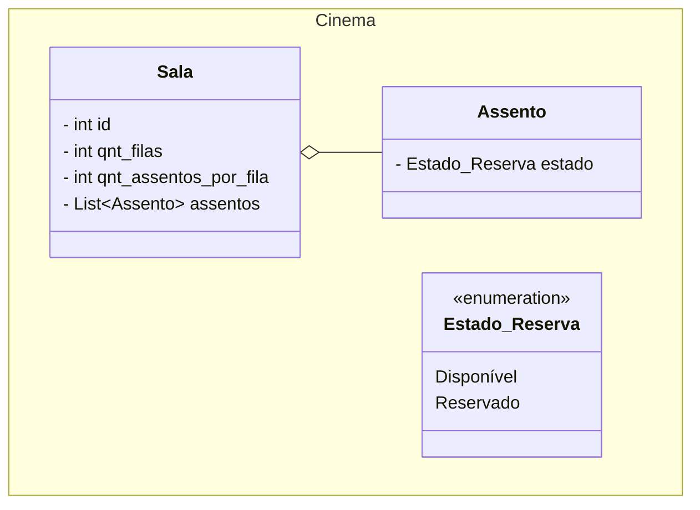
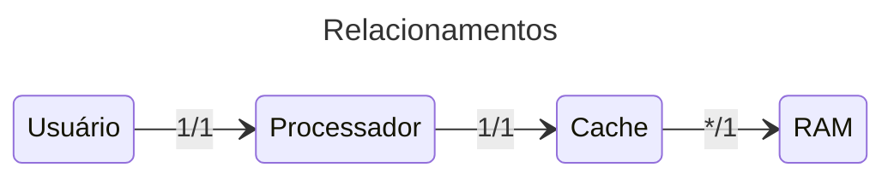

# Reservas de cinema

## Domínio da aplicação

Objetos: Salas e Assentos.

### Salas

- Cada um possui uma identificação numérica { 1, 2, 3, ... } e um conjunto de
  assentos, simplificadamente distribuídos em uma matriz com m linhas (qnt_filas)
  e n colunas (qnt_assentos_por_fila).

### Assentos

- Uma posição na matriz de uma sala.
- Possui um conjunto de estados quanto a reserva { Disponível, Reservado }.

## Abstrações de baixo nível

Objetos: Usuários, Processadores, Caches e RAM.

### Usuários

Cada usuário do sistema é associado a um processador/cache.  
O usuário pode realizar as seguintes ações:

- Listar assentos de uma sala, incluindo o estado quanto a reserva
- Efetivar uma reserva

### Processadores

As ações do usuário devem ser gerenciadas por processadores, que se comunicam com
a memória/cache para conseguir as informações necessárias.

### Caches

Uma cache deve armazenar uma porção da memória principal (RAM).  
Questões a serem consideradas:

- Função de mapeamento: aleatória — qualquer bloco da memória pode ser salvo em qualquer linha
- Algoritmo de substituição: FIFO/Queue — o primeiro bloco a ser mapeado é removido
- Gerenciamento de Tags: guardam o mapeamento linha/bloco + status de uso (protocolo MESI)
- Canal de comunicação entre caches

### RAM

Questões de projeto:

- Quantidade de endereços
- Tamanho e tipagem da palavra
- Serialização e deserialização de objetos do domínio

